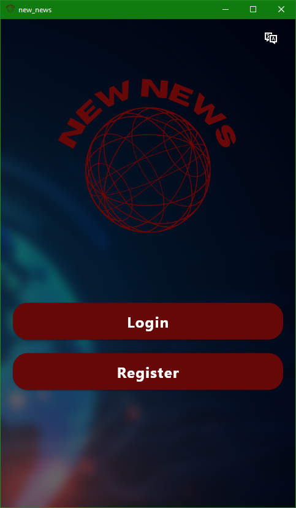
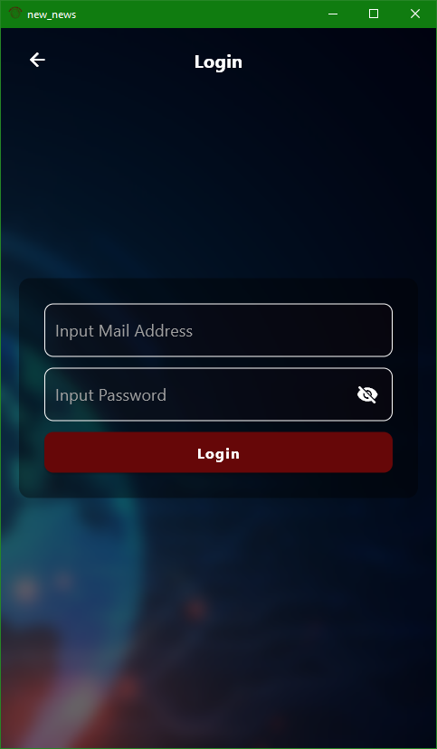

# New News

New News is a Flutter news application designed by Mehmet Can Kaya (Student ID: 211216058) for a school project. It utilizes NewsAPI to provide you with the latest news from around the world, keeping you informed and up-to-date.

## Features

- Browse news articles from various sources and categories.
- Read detailed news articles with images and descriptions.

## Video Record
https://github.com/MehmetJank/new_news/assets/92443831/b079622f-126d-4bb2-b0ab-2c1dce939b4c

## Screenshots

### Welcome Screen

| Login Screen                                  | Register Screen                                     |
| --------------------------------------------- | --------------------------------------------------- |
|  |  |

| News Screen Dark Mode                                      | News Screen Light Mode                                       |
| ---------------------------------------------------------- | ------------------------------------------------------------ |
|  |  |

| Category News Screen Dark Mode                                          | Category News Screen Light Mode                                           |
| ----------------------------------------------------------------------- | ------------------------------------------------------------------------- |
|  |  |

| Settings Screen Dark Mode                                          | Settings Screen Light Mode                                          |
| ------------------------------------------------------------------ | ------------------------------------------------------------------- |
|  |  |

| Profile Screen Dark Mode                                         | Profile Screen Light Mode                                          |
| ---------------------------------------------------------------- | ------------------------------------------------------------------ |
|  |  |

| Help Center Screen Dark Mode                                      | Help Center Screen Light Mode                                       |
| ----------------------------------------------------------------- | ------------------------------------------------------------------- |
|  |  |

| Create Support Ticket Screen Dark Mode                                       | Create Support Ticket Screen Light Mode                                        |
| ---------------------------------------------------------------------------- | ------------------------------------------------------------------------------ |
|  |  |

| Ticket List Screen Dark Mode                                             | Ticket List Screen Light Mode                                              |
| ------------------------------------------------------------------------ | -------------------------------------------------------------------------- |
|  |  |

| Ticket Details Screen Dark Mode                                                | Ticket Details Screen Light Mode                                                 |
| ------------------------------------------------------------------------------ | -------------------------------------------------------------------------------- |
|  |  |

## Technologies Used

- Flutter
- Dart programming language
- News API for fetching news data
- Firebase for user authentication and data storage

## How to Run

1. Clone the repository: `git clone https://github.com/MehmetJank/new_news.git`
2. Navigate to the project directory: `cd new_news`
3. Install dependencies: `flutter pub get`
4. Run the app: `flutter run`
