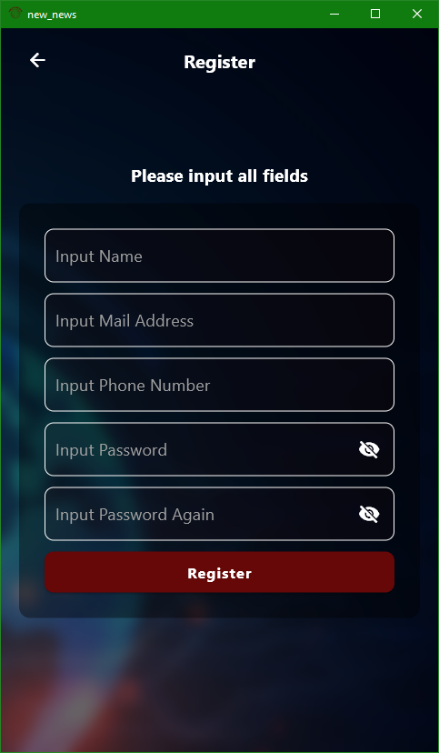

# New News

New News is a Flutter news application designed to keep you informed and up-to-date with the latest news from around the world.

## Features

- Browse news articles from various sources and categories.
- Read detailed news articles with images and descriptions.

## Video Record

https://github.com/MehmetJank/new_news/assets/92443831/469c87f1-bbba-4fca-87e1-3291ce92ca67

## Screenshots

## Technologies Used

- Flutter
- Dart programming language
- News API for fetching news data
- Firebase for user authentication and data storage

## How to Run

1. Clone the repository: `git clone https://github.com/username/NewNews.git`
2. Navigate to the project directory: `cd NewNews`
3. Install dependencies: `flutter pub get`
4. Run the app: `flutter run`

## Contributing

Contributions are welcome! If you have any suggestions, bug reports, or feature requests, please open an issue on the GitHub repository.

## License

This project is licensed under the MIT License. See the [LICENSE](LICENSE) file for more information.
